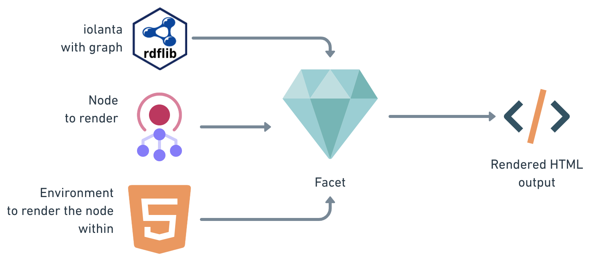
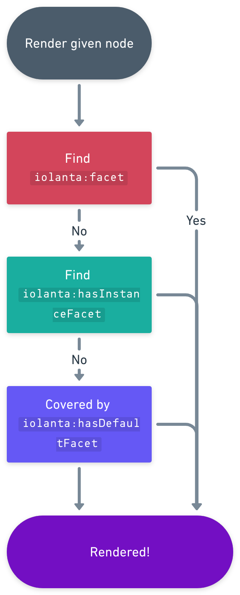
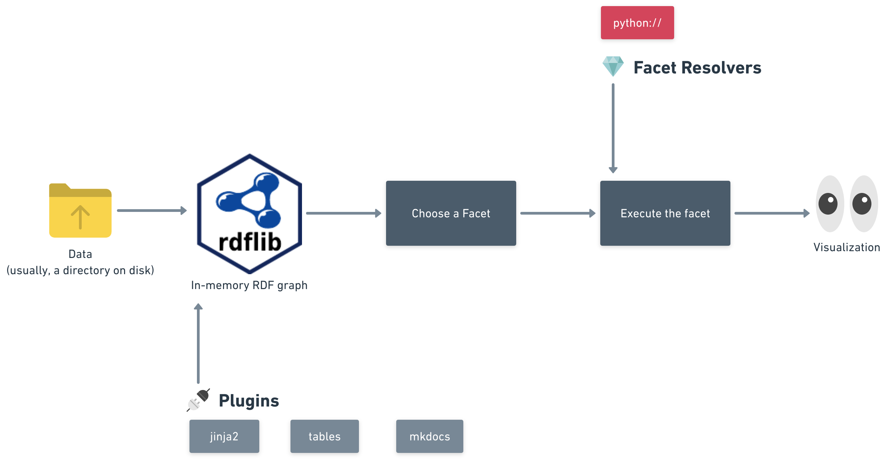

{# todo: Retrieve last updated time from Github #}
{# todo: Format the Blog index page properly #}
{# todo: Write README.md at iolanta-tech repo #}

<style>
.no-min-width th {
  min-width: 2rem !important;
}
</style>

Linked Data ⋅ JSON-LD ⋅ YAML-LD ⋅ Data Visualization

!!! info "Abstract"
    **Purpose:** Linked Data in its raw form, as a collection of triples (or quads) — is arguably not easily comprehensible for a human being. Linked Data visualization is a conversion from triples to a visual form (a table, a chart, et cetera) — a form that we humans can easily read, understand, and interact with. The method and particular details of a visualization very much depend on the purpose data is visualized for.
    
    **Methodology:** A minimalistic yet extendable vocabulary is proposed to guide visualization based on the data and to allow customization of the visual form via the knowledge graph itself. A plugin based visualization software architecture implementing the vocabulary is proposed and its main algorithm is described. A software tool implementing the proposed principles is built and published as an open source project. A few plugins for it (implementing a few visualization types and integrations) are also provided.
    
    **Findings:** A significant portion of this paper has been built from Linked Data using the software being demonstrated. Documentation pages for the software were also partially generated from knowledge expressed as Linked Data. It is believed that the toolset facilitates productivity and aids reuse of knowledge.
    
    **Value:** Knowledge reuse and wider adoption of Linked Data as lingua franca among professionals from various fields promises to improve decision making quality humanity can afford, which should improve our ability as a species to tackle the difficult issues we are facing. This is an attempt to make a small step forward in this direction.

## Introduction

If professionals in software development or in other areas are to utilize Linked Data technology in their work they probably cannot be expected to dive deep into the depths of raw triples, which are not very suitable for human consumption. Users would prefer to use tools capable of *visualizing* the raw triples, converting them into a form better suitable for human eye.

That need is met with Linked Data visualization tools — software systems which present Linked Data as :material-view-list: lists, :material-table: tables, :material-chart-bar: charts, :material-map: maps, :material-file-tree: trees, :material-graph: graphs or any other form[^data-visualizations-periodic-table] of data visualization known to humanity.

[^data-visualizations-periodic-table]: https://www.visual-literacy.org/periodic_table/periodic_table.html 

Over last decades, significant efforts have been put into visualizing Linked Data. A comprehensive survey of methods and tools as of 2020 is available at the **Linked Data Visualization** book[^ld-visualization-book], authors of which list, evaluate and compare a handful of available visualization systems.

[^ld-visualization-book]: Linked Data Visualization: Techniques, Tools and Big Data. — Laura Po, Nikos Bikakis, Federico Desimoni, and George Papastefanatos | Morgan & Claypool, 2020 http://www.linkeddatavisualization.com/

As an illustration, we are reproducing Table 3.1 from the book here (figure X), which lists a number of visualization tools and shows which data types and visualization modes every tool supports. The table was slightly modified when reproducing here:

* Tools which were not marked as **Available** in the original are excluded because, from a practical viewpoint of a working professional, they no longer exist;
* The **Setting** and **Application Type** columns are omitted since they say "Generic" and "Web" respectively in every row of the table;
* The original table used single-character codes to denote data and visualization types (for instance, `C` stands for "chart"), — we use icons instead. When viewing this paper as HTML, please hover over an icon to see a tooltip explaining its meaning.

{# todo: Is this figure really necessary? Maybe we should tabulate Fresnel, Vega, Tal4RDF tools instead? #}

<figure class="no-min-width" markdown>
{{ render("tools-with-various-visualizations") }}
<figcaption markdown>
<strong>Figure 3.</strong>
Visualization tools supporting multiple visualizations[^ldvisualization-book] (page 54).<br/>
See [:material-github: data](https://github.com/iolanta-tech/iolanta-tech/blob/master/docs/blog/whitepaper/state-of-the-art/various-visualizations.yaml)
& [:material-github: table definition](https://github.com/iolanta-tech/iolanta-tech/blob/master/docs/blog/whitepaper/state-of-the-art/various-visualizations/table.yaml).
</figcaption>
</figure>

## Shoemaker's son

Table 3.1 describes only a subset of all visualization tools the book as a whole explores, and it itself is only one of multiple tables, charts, timelines the book contains. Nonetheless, none of the **data visualizations** the book enjoys are built with any of the **visualization tools** the book explores, or, at least, no mention of such could be found by me when reading the book.

The authors had put an immense effort into setting up, comparing and analysing Linked Data visualization software, but none of the tools they tried gave them an impression that it can aid them in the complex and tedious task of authoring a book, — a process solely focused on analysing, managing and distilling information, a kind of work that Linked Data should be most useful for.

## Can we do better?

What kind of a visualization system would aid a task like preparing the Linked Data Visualization book, or, say, the paper you are so kind and forthcoming to be reading right now?

Tables, one of which is rendered on Figure X, are probably the most predominant methods of visualizing data, thus our dream visualizer should be capable of drawing tables.

!!! info "Criterion 1"
    {{ render('criterion1') }}

The same chunk of data can be rendered differently for different purposes. Check out Figure X1, which uses the same data as Figure X but shows it a little bit differently.

<figure class="no-min-width" markdown>
{{ render("tools-with-various-visualizations-augmented") }}
<figcaption markdown>
<strong>Figure X.</strong>
Visualization tools supporting multiple visualizations[^ldvisualization-book] (page 54), with additions.<br/>
See [:material-github: data](https://github.com/iolanta-tech/iolanta-tech/blob/master/docs/blog/whitepaper/state-of-the-art/various-visualizations.yaml)
& [:material-github: table definition](https://github.com/iolanta-tech/iolanta-tech/blob/master/docs/blog/whitepaper/state-of-the-art/various-visualizations/table-augmented.yaml).
</figcaption>
</figure>

The original data was augmented:

* **Last Update** column shows the date of last changes touching the software, observed as of spring 2023;
* **Available** is the evaluation of the tools' availability as of spring 2023;
* **Comment** offers some notes about how the first two were obtained.

This table is different from the previous one, it highlights different aspects of the data and shows different columns, which brings about another criterion:

!!! info "Criterion 2"
    {{ render('criterion2') }}

The list of visualization formats listed at Figure X is rather extensive but definitely not exhaustive. There might be narrow focused, domain specific visualizations, such as a DNA strand rendering or a chemical formula rendering. Other visualizations might be medium specific, for instance, an interactive representation of a table intended for viewing in virtual reality.

We can't predict what kind of visualizations developers would want to build for our system, we should give them freedom to build whatever they want. A restricted, stripped-down language or notation for visualizations would undermine that purpose.

!!! info "Criterion 4"
    {{ render('criterion4') }}

One singular visualization system can't encompass all imaginable possibilities. A plugin mechanism is necessary to support independent developers writing new exciting visualizations.

!!! info "Criterion 5"
    {{ render('criterion5') }}

## Describe Linked Data visualizations in Linked Data itself

The heading of this chapter captures the main idea of this paper.

If we could describe a table like that on Figure Y as a piece of Linked Data targeted at visualizing another piece of Linked Data, we would have gained a number of immediate advantages.

Applying the 5-star model of Linked Data[^5-star] to visualizations themselves seems to promise a few valuable benefits:

[^5-star]: https://www.w3.org/2011/gld/wiki/5_Star_Linked_Data

* *Visualization is available on the Web* which enables anyone to retrieve and enjoy applying to the data,
* *Visualization is available as machine-readable structured data* and can be not only reused but easily customized,
* *Available in a non-proprietary format,* say as a JSON-LD (or any other RDF serialization) document,
* *Published using open standards from the W3C*, which JSON-LD is,
* *All of the above and links to other Linked Open Data* — which it does because a visualization must reference certain aspects of source data to specify how to visualize that.

{# todo: Format the 5-star list somehow nicely #}

The role of the visualization system is to consume both data and visualization tied to it and output the rendered result — in our case, an HTML table. 
 
What kind of vocabulary could be used to describe visualizations, then?

### Fresnel Vocabulary

{# todo: Tabulate Fresnel based tools #}

Fresnel Vocabulary[^fresnel] is a browser-independent vocabulary to specify how to render an RDF model. Fresnel's two foundational concepts are as follows:

[^fresnel]: https://www.w3.org/2005/04/fresnel-info/

* *lenses* define which properties of an RDF resource to display and how to order them,
* *formats* define how to render those properties using
    * RDF-specific formatting attributes
    * and hooks to CSS[^css].

[^css]: http://www.w3.org/Style/CSS/

The visualization process Fresnel uses is described in Figure X.

<figure markdown>

<figcaption>
<strong>Figure X.</strong>
Fresnel visualization process.<br/> (Drawn by hand.)
</figcaption>
</figure>

While Fresnel aims to be platform independent, it still has a binding to CSS, thus making HTML and SVG kind of preferred formats.

Fresnel vocabulary is used by a number of tools:

{# todo: Describe Fresnel tools better #}
{# todo: Add more Fresnel tools, look into the book #}

<figure class="no-min-width" markdown>
{{ render("fresnel-tools") }}
<figcaption markdown>
<strong>Figure X.</strong>
Visualization tools based on Fresnel vocabulary.<br/>
See [:material-github: data & table definition](https://github.com/iolanta-tech/iolanta-tech/blob/master/docs/blog/whitepaper/state-of-the-art/fresnel.yaml)
</figcaption>
</figure>

Can we have something more independent from the medium? {# todo: Expand while Fresnel is not so good #}

### Tal4RDF

{# todo: Explore Tal4RDF #}

### Vega RDF

{# todo: Explore Vega RDF #}

[^sparql]: SPARQL Query Language {# todo: provide a link #}

{# todo: Enumerate figures #}


## Iolanta

To solve the issues outlined above, we propose an open source visualization tool by the name of `iolanta`, build in Python programming language. Iolanta is used to build this paper, and the website the paper is published at: [:globe_with_meridians: iolanta.tech](https://iolanta.tech), in combination with [:book: mkdocs](https://mkdocs.org) static site generator.

The code is published on GitHub as [:material-github: iolanta-tech/iolanta-tech](https://github.com/iolanta-tech). The repository is equipped with a [:simple-markdown: `README.md`](https://github.com/iolanta-tech/iolanta-tech/blob/master/README.md) file which explains how to clone the repository and run the site locally. That provides:

* a full locally accessible snapshot of `iolanta` documentation,
* and a readily available sandbox to play with the system.

Henceforth, we will demonstrate step-by-step how to describe data about Linked Data visualization tools — and render them in the form illustrated by Figure 3.

### Provide data

<figure markdown>
  <div style="text-align: left" markdown>
    {{ code('blog/whitepaper/state-of-the-art/various-visualizations.yaml', title='various-visualizations.yaml', language='yaml', last_line=16) }}
  </div>
  <figcaption markdown><strong>Figure X.</strong> Visualization tools file. See [:material-github: `various-visualizations.yaml`](https://github.com/iolanta-tech/iolanta-tech/blob/master/docs/blog/whitepaper/state-of-the-art/various-visualizations.yaml) in the Supplementary Material.</figcaption>
</figure>

**What file format is this?** This is YAML[^yaml]. To be more precise, this is YAML-LD[^yaml-ld], a mapping of JSON-LD[^json-ld] from JSON[^json] to YAML.

**What does `$id` mean?** This is an alias of [`@id`](https://www.w3.org/TR/json-ld/#node-identifiers) JSON-LD keyword. The alias itself is defined in YAML-LD [:material-github: Convenience Context](https://github.com/json-ld/convenience-context), which maps `@`-keywords of JSON-LD to `$`-keywords of YAML-LD. That's done because `@` is a reserved character in YAML, and identifiers starting with `@` have to be surrounded by quotes.

**What is `VisualizationTool`?** That is name of an `rdfs:Class` we're going to use to describe every visualization tool we list in Table 3. We will refer to that class when we render the table. Base `iolanta` vocabulary contains `"@base": "local:"` definition; therefore, when converting to RDF, this will be mapped to an IRI node `local:VisualizationTool`.

**What is `$reverse`?** As with `$id`, it is an aliased JSON-LD [`$reverse`](https://www.w3.org/TR/json-ld/#reverse-properties) keyword. It has one field, in this case `rdf:type`; and `rdf:type` can have multiple children, each of which will be assigned `VisualizationTool` class via an `rdf:type` edge. This allows us to avoid specifying `$type: VisualizationTool` for every single item we want to describe.

[^yaml]: https://yaml.org/spec/1.2.2/
[^yaml-ld]: :material-github: https://github.com/json-ld/yaml-ld
[^json-ld]: https://json-ld.org
[^json]: https://json.org

### Render something

Having cloned the repository and installed Iolanta, we can `cd` to the root directory for the repo and run the following shell command:    

```html title="$ iolanta render rhizomer --as iolanta:html"
<a href="https://rhizomik.net/rhizomer">Rhizomer</a>
```

This will:

* Read all `.yaml`, `.json` and `.md` files in the repository,
* Load them into an in-memory Iolanta RDF graph,
* And try to visualize the particular node we asked for, which in this example is `$id: rhizomer`.

As we can see, it renders a piece of HTML code that represents a hyperlink. The text of the hyperlink is incidentally equivalent to the value of `rdfs:label` property for the `rhizomer` node, and the link address is equivalent to `schema:url` property value.

That's not a coincidence. This link was rendered by class `iolanta.facets.html.default:Default`, inherited from `iolanta.facets.facet:Facet`. Facet will:

* Execute a SPARQL[^sparql] query against Iolanta graph, retrieving `rdfs:label`, `schema:url` and few more properties;
* Render an HTML `<a>` tag using the obtained information.

### What is a facet, anyway?

The word *facet* is defined by Cambridge Dictionary[^facet-dictionary] as:

[^facet-dictionary]: https://dictionary.cambridge.org/dictionary/english/facet

> one part of a subject, situation, etc. that has many parts

or

> one of the parts or features of something

The same notion or piece of data might be visualized as a list, a table, or maybe an interactive 3D landscape, but none of those changes the nature of the object being represented. It might be said every representation of an object is another way of looking at it, a new angle, feature, a facet of the object.

In Iolanta terminology, facet is a piece of executable computer code which is called to visualize a particular node in the RDF graph. It can be described as a black box with inputs and outputs charted on Figure X.

<figure markdown>
  
  <figcaption><strong>Figure X.</strong> Facet as a black box (drawn by hand)</figcaption>
</figure>

### What is `environment` for?

In this example, `rhizomer` is supplied as the `node`, and `iolanta` contains a queryable RDF graph composed from all files in the active directory that Iolanta can understand, — including the YAML-LD file describing what `rhizomer` is. What is `environment`?

In this particular case, we supply [`iolanta:html`](https://iolanta.tech/html) as `environment` — via the argument `--as` to the command line call. There might be any number of environments, for instance, `iolanta:tex` or `iolanta:cli`, — that makes Iolanta usable for a multitude of contexts, not just HTML generation.

{# todo: implement iolanta.tech/html page so as this link isn't dead #}


!!! info "iolanta:Environment"
    Data visualization might be performed in various contexts, which we call Environments. For instance:

    * `iolanta:html` calls for HTML output;
    * `iolanta:cli` is for rendering in the command line;
    * `iolanta:tex` is for LaTeX documents.

Environment influences generation, so that we don't output TeX markup into an HTML document, and vice versa, and it does that by influencing the **facet selection** for the particular node.

Indeed, here is a definition from Iolanta code:

```yaml
$id: iolanta:html
$type: iolanta:Environment
owl:sameAs:
  $id: https://html.spec.whatwg.org/
iolanta:hasDefaultFacet: python://iolanta.facets.html.Default
```

Here, `iolanta` resolves to `https://iolanta.tech/`, and `iolanta:hasDefaultFacet` defines that the `html.Default` class we've mentioned earlier is the default facet to render *anything* for `iolanta:html`.

{# todo: Document hasDefaultFacet on iolanta.tech #}

!!! info "iolanta:hasDefaultFacet"
    Define a default facet used for that environment.

    * Domain: `iolanta:Environment`
    * Range: `iolanta:Facet`
    * Inverse: `iolanta:isDefaultFacetOf`

That's why it was chosen for `rhizomer` in our example above.

We will describe the facet selection algorithm in detail a little later.

### Render in MkDocs

`iolanta-tech` website is built with MkDocs[^mkdocs] static site generator, with which Iolanta can integrate via `mkdocs-iolanta`[^mkdocs-iolanta] plugin. This plugin, together with `mkdocs-macros-plugin`[^mkdocs-macros-plugin] introduces a Jinja2 template macro looking like this:


```jinja2
{{ render('rhizomer') }}
```


which renders to: {{ render('rhizomer') }}. As we can see, HTML markup generated by Iolanta is now rendered in the page itself as its integral part. We will use that to render an HTML table in the next section.

[^mkdocs-iolanta]: :material-github: https://github.com/iolanta-tech/mkdocs-iolanta
[^mkdocs-macros-plugin]: {# todo link to mkdocs-macros-plugin #} mkdocs-macros-plugin


### Let's render a table now

{# todo: Draw graph of the table structure v1 #}

<figure markdown>
  <div style="text-align: left">
    {{ code('blog/whitepaper/state-of-the-art/various-visualizations/v1.yaml', language='yaml', title='various-visualizations-v1.yaml') }}
  </div>
  <figcaption><strong>Figure X.</strong> Table definition v1</figcaption>
</figure>

* `various-visualizations-v1` is the RDF node that describes this table;
* `table:columns` defines the list of RDF properties to render as columns of the table;
* `table:class` is the `rdfs:Class` instances of which will be converted to table rows.

Using this kind of markup, we store the table description in the RDF graph itself.

!!! success "Criterion 2 is satisfied"
    {{ render('criterion2') }}

Figure X shows how this table is rendered via `{{ render('various-visualizations-v1') }}` template call.

<figure markdown>
  {{ render('various-visualizations-v1') }}
  <figcaption><strong>Figure X.</strong> Table v1</figcaption>
</figure>

We rendered this as a table now!

!!! success "Criterion 1 is satisfied"
    {{ render('criterion1') }}

How did it work though?

The table rendered at figure X is represented by the node `various-visualizations-v1`, which (via the `$type` property) as an instance of `table:Table`. The [`table:`](https://iolanta.tech/tables/) prefix is defined by `iolanta-tables`[^iolanta-tables] plugin.

!!! success "Criterion 5 is satisfied"
    {{ render('criterion5') }}

[^iolanta-tables]: https://iolanta.tech/tables

`iolanta-tables` defines the following:

```yaml
$id: table:Table
rdfs:comment: "Definition of a table."
iolanta:hasInstanceFacet:
  - $id: python://iolanta_tables.facets.html.Table
    iolanta:supports:
      $id: iolanta:html
```

[`iolanta:hasInstanceFacet`](https://iolanta.tech/hasInstanceFacet) property tells us that every node of `table:Table` type can be rendered by `html.Table` facet.

!!! info "iolanta:hasInstanceFacet"
    Facet assigned by node type.

    * Domain: `rdfs:Class`
    * Range: `iolanta:Facet`
    * Inverse: `iolanta:isInstanceFacetOf`

`iolanta:supports` property also specifies that `html.Table` facet can work in `iolanta:html` environment, — to distinguish it from facets which render tables in `iolanta:tex` or `iolanta:cli`.

!!! info "iolanta:supports"
    Specify that facet can work in the specific environment.

    * Domain: `iolanta:Facet`
    * Range: `iolanta:Environment`
    * Inverse: `iolanta:isSupportedBy`

### Prettify the table

<figure markdown>
  {{ render('various-visualizations-v2', environments='side-by-side') }}
  <figcaption><strong>Figure X.</strong> Table v2</figcaption>
</figure>

In this snippet, we introduced a new `table:self` column. That's not a property, say, `rhizomer` has; it means that we render the node itself (the `rhizomer` node) — and for that the `Default` facet we already know will be employed, — which will be presented as a clickable HTML link.

In addition, we use [`table:order-by`](https://iolanta.tech/tables/order-by) to sort the table by year.

{# todo: table:order-by does not work, table is not sorted. #}
{# todo: table v2 is too long, render only tools which can render tables #}

### Prettify the table again

<figure markdown class="no-min-width">
  {{ render('various-visualizations-v3', environments='side-by-side') }}
  <figcaption><strong>Figure X.</strong> Table v3</figcaption>
</figure>

In this snippet, we define [`mkdocs-material:icon`](https://mkdocs.iolanta.tech/material/icon) property to use mkdocs[^mkdocs] specific icon as column header.

## The final table

Figure X is visualized from the following description:

<figure markdown>
  <div style="text-align: left">
    {{ code('blog/whitepaper/state-of-the-art/various-visualizations/table.yaml', title='table.yaml', language='yaml', last_line=16) }}
  </div>
  <figcaption><strong>Figure X.</strong> Visualization tools table file</figcaption>
</figure>

{# todo: There is a rogue </td> printed above. #}

Here, we use nested [`table:columns`](https://iolanta.tech/tables/columns) properties to group columns.

!!! success "Criterion 3 is satisfied"
    {{ render('criterion3') }}

!!! success "Criterion 4 is satisfied"
    {{ render('criterion4') }}

#### Property: `iolanta:facet`

{# todo: Invent an example to illustrate iolanta:facet #}

* Range: `iolanta:Facet`

This property might be attached to any IRI or BNode in an RDF graph. If we decidedly know which facet to use for a particular node we can explicitly connect the node and the facet in our RDF graph. For example:

```
    :something iolanta:facet <python://iolanta.facets.html.Default> .
```

From this example, it is evident how we identify facets. These are import paths native for Python programming language, which we define by `python://` protocol.


## `iolanta` vocabulary

`iolanta` operation is based on a simple vocabulary, bundled with the application. Iolanta vocabulary defines a few classes and a few properties connecting classes to each other.

Prefix we use is `iolanta:`, and it resolves to https://iolanta.tech/.

<figure>
  
  <figcaption><strong>Figure X.</strong> <code>iolanta:</code> vocabulary (Drawn by hand)</figcaption>
</figure>

In Iolanta terminology, Facet is a unit of executable program code used to visualize RDF nodes in an [Environment](#class-iolantaenvironment). Generally speaking, facet can be described as a black box which has three inputs:

* Identifier of an RDF `node` to visualize (an IRI, a Blank Node, or a Literal);
* Identifier of an `environment` (IRI or Blank Node) which the node must be visualized within;
* `iolanta` instance, which contains the current graph queryable via SPARQL {# todo: cite #}.

Facet can run arbitrary SPARQL queries against `iolanta` graph to retrieve any information about the `node` it might require.

Current version of `iolanta` supports only one kind of Facets: Python classes which are subclasses of `iolanta.Facet` abstract base class.

We do not store program code in the graph itself; that seems both inconvenient and insecure. Instead, in the graph facets are addressed via IRIs. For instance, `python://iolanta.facets.generic.BoolLiteral` is the facet that renders an `xsd:boolean` value as a Unicode icon.

Not every facet suits every possible environment. For instance, if a facet returns a string that contains HTML code that result would be next to useless for a \LaTeX document, and vice versa. Thus, it is necessary to describe for every facet which environment(s) it is suitable for. We use `iolanta:supports` for that.


## Facet search algorithm

<figure markdown style="text-align: center">
  
  <figcaption><strong>Figure X.</strong> Iolanta facet search algorithm<br/><em>(drawn by hand)</em></figcaption>
</figure>

`Iolanta.render()` method accepts arguments:

{# todo: Generate the function description instead of writing stuff by hand #}

* `node` is an RDF node to render;
* `environments` is a **list** of `iolanta:Environment` instance references.

Given that information, we need to find a facet in our graph and execute that facet to construct a visualization for our node in one of these environments.


* Look for `iolanta:facet` link such that `\$node iolanta:facet ?facet . ?facet iolanta:supports ?environment` .

{# todo: describe iolanta-tables vocabulary with examples and illustrations #}

## Architecture

<figure markdown>
  
  <figcaption><strong>Figure X.</strong> Iolanta architecture<br/><em>(drawn by hand)</em></figcaption>
</figure>

## Iolanta browser

Iolanta browser is an open source tool built in Python programming language in attempt to illustrate the principles of this article and pave a way to a powerful, versatile Linked Data visualization system.

{# todo: a diagram of how the browser works #}


## Categories

In Figure 2 we reproduce the categories of Linked Data visualization tools that Blomquist at al indicate, and select the particular categories we will be interested in.

<figure>
  {{ render("whitepaper-categories") }}
  <figcaption><strong>Figure 2.</strong> Visualization tools categories</figcaption>
</figure>

{# todo: link to YAML source on GitHub #}

Let's examine the two categories which look promising.

…

{# todo: Not all necessary columns are rendered, fix that #}
{# todo: SHACL! #}

#### Browsers

<figure>
  {{ render("browsers") }}
  <figcaption><strong>Figure 4.</strong> Linked Data browsers</figcaption>
</figure>

{# todo: "#### Publication systems" #}
{# todo: MetaFactory #}
{# todo: kg mkdocs plugin #}


#### LESS

LESS[^less] is a Linked Data browser which seems to satisfy that requirement.

[^less]: Auer, Sören & Doehring, Raphael & Tramp, Sebastian. (2010). LESS - Template-Based Syndication and Presentation of Linked Data. 6089. 211-224. 10.1007/978-3-642-13489-0_15.

LESS is based on a template language inspired by Smarty[^smarty] PHP templates. An interactive template editor aids the user in crafting a template for their particular needs; then, the resulting template can be published on a LESS Repository online and then embedded into various third-party applications:

[^smarty]: https://smarty.net

> …a blogger writing about a recent trip to Berlin can easily integrate a nicely formatted fact box with important information about Berlin obtained from Wikipedia into her blog post. A community of science fiction fans can integrate lists on a recent BBC programming matching their preferences into their community portal.

With Smarty (or any other template language), template reuse seems to pose a challenge. `schema:url` property on an object will always mean that the object has a hypertext link associated with it. The author of every template out there will have to remember that, — there is no way to say that `schema:url` in HTML context is always rendered as an `<a>` tag. Which seems to be a reason of a lot of repetition among templates. Can we leverage the information already contained in the Linked Data to reduce that kind of repetition? 

The dataset might specify certain details of visualizations using special vocabularies. For instance, for tabular visualizations those can be:

* list of columns to render,
* property associated with each column,
* sorting and grouping of rows.

If the visualization is to implement these requirements, it cannot be implemented in Smarty or another template language. Template languages are oftentimes inherently and purposefully limited compared to full scale Turing-complete programming languages.

{# todo: target this better to the book writing use case #}

## Future research

* Implement more plugins for various use cases, such as:
    * drawing roadmaps and network planning,
    * drawing C4 {# todo: source #} architecture diagrams,
    * and more;
* Provide interactive browsing experience;
* Implement more facet types, such as:
    * Web components,
    * JSON-RPC {# todo: source #} controlled plugins;
* Improve the experience of browsing remote networks;
* …
