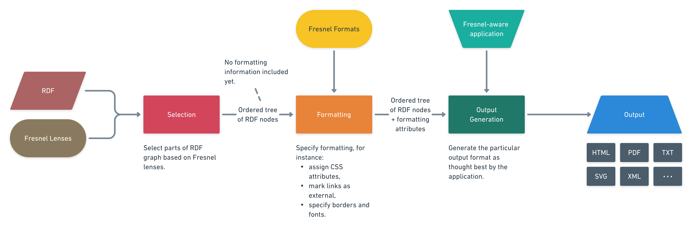

<style>
.no-min-width th {
  min-width: 2rem !important;
}
</style>

Linked Data ⋅ JSON-LD ⋅ YAML-LD ⋅ Data Visualization

!!! info "Abstract"
    **Purpose:** Linked Data in its raw form, as a collection of triples (or quads) — is arguably not easily comprehensible for a human being. Linked Data visualization is a conversion from triples to a visual form (a table, a chart, et cetera) — a form that we humans can easily read, understand, and interact with. The method and particular details of a visualization very much depend on the purpose data is visualized for.
    
    **Methodology:** A minimalistic yet extendable vocabulary is proposed to guide visualization based on the data and to allow customization of the visual form via the knowledge graph itself. A plugin based visualization software architecture implementing the vocabulary is proposed and its main algorithm is described. A software tool implementing the proposed principles is built and published as an open source project. A few plugins for it (implementing a few visualization types and integrations) are also provided.
    
    **Findings:** A significant portion of this paper has been built from Linked Data using the software being demonstrated. Documentation pages for the software were also partially generated from knowledge expressed as Linked Data. It is believed that the toolset facilitates productivity and aids reuse of knowledge.
    
    **Value:** Knowledge reuse and wider adoption of Linked Data as lingua franca among professionals from various fields promises to improve decision making quality humanity can afford, which should improve our ability as a species to tackle the difficult issues we are facing. This is an attempt to make a small step forward in this direction.

## Introduction

**As** a Semantic Web enthusiast, **I want** to see a wider adoption of Semantic Web technology **because** I believe it to be beneficial to humanity. {# todo: link to this kind of use case template #}

As a software related technology, Semantic Web & Linked Data should be used, first and foremost, by software engineering professionals. StackOverflow[^stackoverflow], a top Q&A hub many developers around the world use, provides popularity statistics per question tag. An attempt to chart statistics for a few Semantic Web related tags yields[^stackoverflow-trends] the chart below.

<figure markdown>
  
  <figcaption><strong>Figure 1.</strong> StackOverflow trends for a few Semantic Web related tags</figcaption>
</figure>

{# todo: link to YAML source on GitHub #}

[^stackoverflow]: https://stackoverflow.com
[^stackoverflow-trends]: https://insights.stackoverflow.com/trends?tags=rdf%2Cowl%2Csparql

This chart highlights several issues catching the eye:

1. Clearly, the wide software development community treats Semantic Web as a very niche technology: the popularity of the selected tags almost never exceeds 0.05% of all questions asked. SPARQL[^sparql] is the clear leader;
2. StackOverflow has more related tags (such as `rdfs`, `linked-data`, `json-ld`), — but the Trends tool does not permit to select them, presumably due to them being even less popular than the ones we were able to render;
3. Most concerning, however, is the fact that the interest to the highlighted tags **does not grow** over time.

[^sparql]: SPARQL Query Language {# todo: provide a link #}

There are probably multiple potential reasons to this situation, let us name a few of those:

* Perhaps Semantic Web and Linked Data aren't that useful after all, maybe they are a technology for the sake of technology which no one really needs?
* Or maybe Semantic Web really has potential but there are obstacles to its realization?
  Among which may be, for instance:
    * Lack of a clear problem or user pain that Linked Data can solve,
    * Deficiencies of tooling to solve existing problems with Linked Data,
        * Linked Data export ← from software systems,
        * Linked Data import → into software systems,
        * Reasoning on Linked Data,
        * Linked Data Visualization for human eye
          > ⬆️ This is the one this post looks into, by the way ☺
    * Lack of viable commercial models for companies to profit from such solutions,
    * Or maybe unwillingness of the wide community to try and play with the Linked Data approach.

{# todo: Draw the list above as an `iolanta-roadmap` diagram perhaps. #}

{# todo: reference the Criticism about Semantic Web article I think #}

Each of these items might be a subject of a separate book or perhaps even a library but within this paper we will confine ourselves to one question only.

## How do we visualize Linked Data?

If professionals in software development or in other areas are to utilize Linked Data technology in their work they probably cannot be expected to dive deep into the depths of raw triples, which are not very suitable for human consumption. Users would need tools to *visualize* the raw triples, converting them into a form better suitable for human eye.

That need is met with Linked Data visualization tools — software systems which present Linked Data as:

* lists,
* tables,
* charts,
* maps,
* trees,
* graphs,
* and any other form[^data-visualizations-periodic-table] of data visualization known in the industry.

[^data-visualizations-periodic-table]: https://www.visual-literacy.org/periodic_table/periodic_table.html 

Data visualization is a way to help the user create a mental model {# todo: link #}, converting data into understanding; for each particular situation and use case a unique visualization might be needed.

**Linked Data Visualization** book[^ld-visualization-book] provides a comprehensive review of state-of-the-art for Linked Data visualization tools as of 2020. The book lists several dozen software tools and compares them by multiple parameters.

[^ld-visualization-book]: Linked Data Visualization: Techniques, Tools and Big Data. — Laura Po, Nikos Bikakis, Federico Desimoni, and George Papastefanatos | Morgan & Claypool, 2020 http://www.linkeddatavisualization.com/

The book features a number of data visualizations: tables, timelines, and charts, — but curiously enough, it never mentions that these visualizations were **authored** using one or multiple tools the book explores.

The authors had put an immense effort into setting up, comparing and analysing Linked Data visualization software, but none of the tools they tried gave them an impression that it can aid them in the complex and tedious task of authoring a book, — a process solely focused on analysing, managing and distilling information, a kind of work that Linked Data should be most useful for.

This sounds like a shortcoming.

## Can we do better?

Can we build a Linked Data visualization tool which could help prepare visualizations for publications like

* Linked Data Visualization book we mentioned before
* or, say, this article?

What criteria should such a tool satisfy?

### Categories

In Figure 2 we reproduce the categories of Linked Data visualization tools that Blomquist at al indicate, and select the particular categories we will be interested in.

<figure>
  {{ render("whitepaper-categories") }}
  <figcaption><strong>Figure 2.</strong> Visualization tools categories</figcaption>
</figure>

{# todo: link to YAML source on GitHub #}

Let's examine the two categories which look promising.

#### Multiple visualization types

To present analysis results for this category, Table 3.1[^ld-visualization-book] summarizes capabilities which those tools have. We reproduce that table below with a few modifications:

* Tools which were not marked as Available are excluded because, for practical purposes, they no longer exist;
* The `Setting` and `Application Type` columns are omitted because they say "Generic" and "Web" respectively for all elements;
* The original table used single-character codes to denote data and visualization types (for instance, `C` for "chart"), — we use icons instead. Please hover over an icon to see a tooltip explaining its meaning;
* We add a new column :material-table: for tabular visualization and fill in its values.

<figure class="no-min-width">
  {{ render("tools-with-various-visualizations") }}
  <figcaption><strong>Figure 3.</strong> Visualization tools supporting multiple visualizations</figcaption>
</figure>

{# todo: Not all necessary columns are rendered, fix that #}

It is immediately obvious why Figure 3 (or its prototype, Table 3.1 in the book) itself could not be generated using any of these tools: none of them **supports a tabular visualization**.

{# todo: is that right? #}

While it was likely a deliberate design decision, tables are a comparatively simple yet extremely useful form of presenting information, ubiquitous in all kinds of publications. Hence we end up with first Criterion for our target visualization system:

!!! info "Criterion 1"
    Visualization tool must be capable of generating tables.

#### Browsers

<figure>
  {{ render("browsers") }}
  <figcaption><strong>Figure 4.</strong> Linked Data browsers</figcaption>
</figure>

{# todo: "#### Publication systems" #}
{# todo: MetaFactory #}
{# todo: kg mkdocs plugin #}

### Plugin support

The range of available visualizations is infinite, and it would be impossible to accommodate any possible use case in one software package. Users might want to create their own visualizations for their very specific needs. These thoughts call for a plugin approach {# todo: link for that #}, where a visualization toolkit can be extended using predefined hooks via third-party plugins.

{# todo: Show that none of these tools supports plugins. Or do they? #}

!!! info "Criterion 2"
    Visualization tool must be extendable via plugins implementing various data types and visualization types.

{# todo: Write in these criteria as LD to reuse them. #}

### Self-hostedness

In software compilers industry, a self-hosted compiler is a compiler which is capable of compiling itself from source code {# todo: source #}. Can a visualization of Linked Data be self-hosted — in other words, can it be described *as Linked Data*?

Applying the 5-star model of Linked Data {# todo: https://www.w3.org/2011/gld/wiki/5\_Star\_Linked\_Data]  #} to visualizations themselves seems to promise a few valuable benefits:

* *Visualization is available on the Web* which enables anyone to retrieve and enjoy applying to to the data,
* *Visualization is available as machine-readable structured data* and can be not only reused but easily customized,
* *Available in a non-proprietary format,* say as a JSON-LD (or any other RDF serialization) document,
* *Published using open standards from the W3C*, which JSON-LD is,
* *All of the above and links to other Linked Open Data* — which it does because a visualization must reference certain aspects of source data to specify how to visualize that.

{# todo: Format the above somehow nicely #}

Self-hosted Linked Data visualizations should be extremely easy to share and to use for professionals in other areas of human activity, from aerospace engineering to fine arts.

{# todo: target this better to the book writing use case #}

### Embeddability

There are different information tools people utilize to prepare books, papers, presentations:

* Static site builders,
* LaTeX,
* Presentations,
* Word processors,
* Spreadsheets,
* …

The ideal Linked Data visualization system should easily and seamlessly integrate with popular information management and publishing tools.


### Open Source

…

### Plain files

{# todo: write this #}

## Iolanta: tutorial

To solve the issues outlined above, we propose an open source visualization tool by the name of `iolanta`, build in Python programming language. In order to reduce development time and sooner arrive at a minimum viable prototype {# todo: link #} this version of the tool is restricted to two usage scenarios:

* Python-specific application user interface (API),
* Command line interface (CLI).

For installation, `iolanta` requires a working Python 3.10 environment. The installation is handled via `pip`:

```
$ pip install iolanta iolanta-record iolanta-tables
```

Here, we install not only `iolanta` itself but two of its plugins as well.

```
$ iolanta render schema:Person
```


### Visualize a table with something

### Generate a LaTeX table

### Visualize stuff in MkDocs

### Retrieve information from GitHub

### Retrieve information from program text


### Vocabulary for self-hosted visualizations

Description of visualizations requires some meta-vocabulary which should be useful regardless of data type and of visualization type to use. Such a vocabulary should aid the Semantic Web browser orchestrating the visualizations and choosing which visualization type to utilize at any given situation.

#### Fresnel vocabulary

Fresnel Vocabulary [https://www.w3.org/2005/04/fresnel-info/] is a browser-independent vocabulary to specify how to render an RDF model. Fresnel's two foundational concepts are as follows:

* *lenses* define which properties of an RDF resource to display and how to order them,
* *formats* define how to render those properties using
    * RDF-specific formatting attributes
    * and hooks to CSS [http://www.w3.org/Style/CSS/].


The visualization process Fresnel uses is described in see {# todo: Figure — Fresnel vocab #}).



> Stages of RDF Fresnel rendering process.

While Fresnel aims to be platform independent, it still has a binding to CSS, thus making HTML and SVG kind of preferred formats.

Fresnel vocabulary is used by a number of tools:


* IsaViz [https://www.w3.org/2001/11/IsaViz/],
* Longwell / Piggy Bank (SIMILE/W3C/MIT) [http://simile.mit.edu/longwell/] and [http://simile.mit.edu/piggy-bank/],
* Horus [http://www.wiwiss.fu-berlin.de/suhl/bizer/rdfapi/tutorial/horus/index.htm],
* LENA browser [http://isweb.uni-koblenz.de/Research/lena],
* OAT: OpenLink AJAX Toolkit (OpenLink Software) [http://sourceforge.net/projects/oat],
* Marbles [http://mes.github.io/marbles].


## `iolanta` vocabulary

`iolanta` operation is based on a simple vocabulary which is bundled with the application. Iolanta vocabulary defines a few classes and a few properties connecting them to each other.

Prefix we use is `iolanta:`, and it resolves to https://iolanta.tech/.

{# todo: visualize Iolanta ontology as a graph #}

### Class: `iolanta:Environment`

Data visualization might be performed in various contexts, which we call Environments. Iolanta defines a few instances of this class:


* `iolanta:html` calls for HTML output;
* `iolanta:cli` is for rendering in the command line;
* `iolanta:tex` is for \LaTeX documents (such as this paper itself).


`iolanta` plugins might define more environments, for that it is enough to define them as `rdf:type iolanta:Environment`.

### Class: `Facet`

{# todo: what is a facet, anyway? #}

{# todo: what faceted visualization tools already exist? #}

Facet is a unit of executable program code used to visualize RDF nodes in an environment. Generally speaking, facet can be described as a black box which has three inputs:


* Identifier of an RDF `node` to visualize (an IRI, a Blank Node, or a Literal);
* Identifier of an `environment` (IRI or Blank Node) which the node must be visualized within;
* `iolanta` instance, which contains the current graph queryable via SPARQL {# todo: cite #}.


Facet can run arbitrary SPARQL queries against `iolanta` graph to retrieve any information about the `node` it might require. The simplest of all is `iolanta.facets.Link` facet targeted at `iolanta:html` environment.

Current version of `iolanta` supports only one kind of Facets: Python classes which are subclasses of `iolanta.Facet` abstract base class.

{# todo: visualize Facet class in class diagram format or WTF #}

### Property: `iolanta:supports`

* [Domain] `iolanta:Facet`
* [Range] `iolanta:Environment`
* [Inverse] `iolanta:isSupportedBy`

Not every facet suits every possible environment. For instance, if a facet returns a string that contains HTML code that result would be next to useless for a \LaTeX document, and vice versa. Thus, it is necessary to describe for every facet which environment(s) it is suitable for. We use `iolanta:supports` for that.

### Property: `iolanta:facet`

* [Range] `iolanta:Facet`

This property might be attached to any IRI or BNode in an RDF graph. If we decidedly know which facet to use for a particular node we can explicitly connect the node and the facet in our RDF graph. For example:

```
    :something iolanta:facet <python://iolanta.facets.Link> .
```

From this example, it is evident how we identify facets. These are import paths native for Python programming language, which we define by `python://` protocol.

{# todo: This example should be closer to real life #}

{# todo: Visualize this as a graph! #}

### Property: `iolanta:hasInstanceFacet`

*[Domain] `rdfs:Class`
*[Range] `iolanta:Facet`
*[Inverse] `iolanta:isInstanceFacetOf`

It would be tedious to attach `iolanta:facet` to *each and every* node this facet might be able to render; oftentimes, it is sufficient to attach a facet to a whole class of nodes. That's what `iolanta:hasInstanceFacet` is for: `iolanta` will find the facet by classes the node is attached to.

### Property: `iolanta:hasDefaultFacet`

* [Domain] `iolanta:Environment`
* [Range] `iolanta:Facet`
* [Inverse] `iolanta:isDefaultFacetOf`

If neither `iolanta:facet` nor `iolanta:hasInstanceFacet` provide a suitable `iolanta:Facet` then we look into the `iolanta:Environment` the rendering is targeted at. The environment can define a default facet used for that environment.

## Facet search algorithm

{# todo: draw this algorithm as a flow chart #}

`Iolanta.render()` method accepts arguments:

* [node] is an RDF node to render;
* [environments] is a **list** of `iolanta:Environment` instance references.

Given that information, we need to find a facet in our graph and execute that facet to construct a visualization for our node in one of these environments.


* Look for `iolanta:facet` link such that `\$node iolanta:facet ?facet . ?facet iolanta:supports ?environment` .


## Iolanta browser

Iolanta browser is an open source tool built in Python programming language in attempt to illustrate the principles of this article and pave a way to a powerful, versatile Linked Data visualization system.

{# todo: a diagram of how the browser works #}

### Facet API

#### query

#### show

#### render

### Iolanta API

## Iolanta plugins

### iolanta-tables

### iolanta-jinja2

## Future directions


* Implement more plugins for various use cases, such as:
    * drawing roadmaps and network planning,
    * drawing C4 {# todo: source #} architecture diagrams,
    * and more;
* Provide interactive browsing experience;
* Implement more facet types, such as:
    * Web components,
    * JSON-RPC {# todo: source #} controlled plugins;
* Improve the experience of browsing remote networks;
* …
