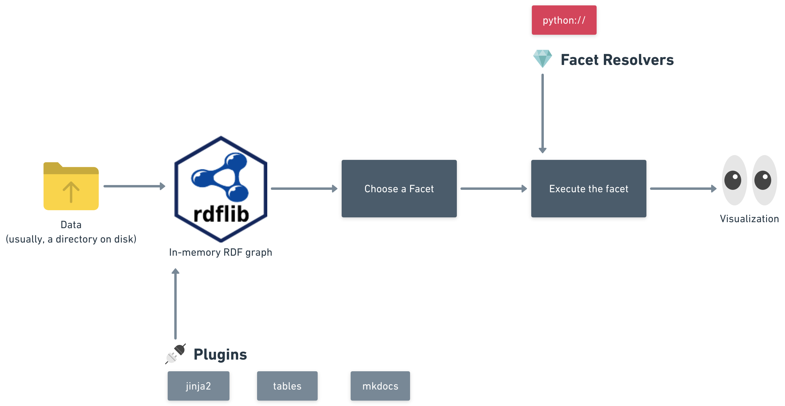

{# todo: Standardize the list of references #}

<style>
.no-min-width th {
  min-width: 2rem !important;
}

pre {
    white-space: pre-wrap;
    word-break: keep-all
}
</style>

Linked Data ⋅ JSON-LD ⋅ YAML-LD ⋅ Data Visualization

!!! abstract
    **Purpose:** {{ page.meta.description }} The method and particular details of a visualization very much depend on the purpose data is visualized for.
    
    **Methodology:** A minimalistic yet extendable vocabulary is proposed to guide visualization based on the data and to allow customization of the visualization via the knowledge graph itself. A plugin based visualization software **architecture** implementing the vocabulary is proposed and its main algorithm is described. A **software tool** implementing the proposed principles is built and published as an open source project. A few plugins for it (implementing a few visualization types and integrations) are also provided.
    
    **Findings:** A significant portion of this paper has been built from Linked Data using the software being demonstrated, as well as documentation pages for the said software. It is suggested that the toolset facilitates productivity and aids reuse of knowledge.
    
    **Value:** Knowledge reuse and wider adoption of Linked Data as lingua franca among professionals from various fields promises to improve decision making quality humanity can afford, which should enhance our ability as a species to tackle the difficult issues we are facing. This work is an attempt to make a small step forward in this direction.

## `1` Introduction

A person who is:

* not a specialist in Linked Data per se,
* but is attempting to leverage Linked Data as a tool for their work or hobby,

— probably cannot be expected to dive deep into the depths of raw triples. Users would prefer to use tools capable of *visualizing* the raw triples, converting them into a form better suitable for human eye.

That need is met with Linked Data visualization tools — software systems which present Linked Data as :material-view-list: lists, :material-table: tables, :material-chart-bar: charts, :material-map: maps, :material-file-tree: trees, :material-graph: graphs or any other form[^data-visualizations-periodic-table] of data visualization imaginable.

[^data-visualizations-periodic-table]: USI eLab. A [periodic table](https://www.visual-literacy.org/periodic_table/periodic_table.html) of visualization methods.

{ align=right style="max-width: 30%" } 

Over last decades, significant efforts have been put into visualizing Linked Data. A comprehensive survey of methods and tools as of 2020 is available at the **Linked Data Visualization** book[^ld-visualization-book], authors of which list, evaluate and compare a handful of available visualization systems.


[^ld-visualization-book]: [Linked Data Visualization](http://www.linkeddatavisualization.com): Techniques, Tools and Big Data. — Laura Po, Nikos Bikakis, Federico Desimoni, and George Papastefanatos | Morgan & Claypool, 2020.

As an illustration, we are reproducing **Table 3.1** from the book here (on {{ render("fig-tools-with-various-visualizations") }}), which lists a number of visualization tools, and shows which data types and visualization modes every tool supports. The table was slightly modified prior to reproduction:

* Tools which were not marked as **Available** in the original are excluded because, from a practical viewpoint of a working professional, they no longer exist;
* The **Setting** and **Application Type** columns are omitted, — since they say `Generic` and `Web` respectively in every row of the table;
* The original table used single-character codes to denote data and visualization types (for instance, `C` stands for "chart"), — we create a separate column for each visualization type instead. When viewing this paper as HTML, please hover over an icon to see a tooltip explaining its meaning;
* The **Year** column was omitted as it is not immediately informative to us.

{# todo: the tools table is too wide #}

<figure class="no-min-width" markdown>
<div markdown style="font-size: 75%">
{{ render("tools-with-various-visualizations") }}
</div>

<figcaption markdown>
<strong>{{ render("fig-tools-with-various-visualizations") }}.</strong>
Visualization tools supporting multiple visualizations[^ld-visualization-book] (Table 3.1, page 54).<br/>

See [:material-github: data](https://github.com/iolanta-tech/iolanta-tech/blob/master/docs/project/whitepaper/state-of-the-art/various-visualizations.yaml)
& [:material-github: table definition](https://github.com/iolanta-tech/iolanta-tech/blob/master/docs/project/whitepaper/state-of-the-art/various-visualizations/table.yaml).
</figcaption>
</figure>

## `2` :material-shoe-cleat: Shoemaker's son

**{{ render("fig-tools-with-various-visualizations") }}** describes only a subset of all visualization tools the book as a whole explores, and it itself is only one of multiple tables, charts, timelines the book contains. Nonetheless, none of the **data visualizations** the book contains are built with any of the **visualization tools**, or, at least, no mention of such could be found.

The authors had put an immense effort into setting up, comparing and analysing Linked Data visualization software, but none of the tools they tried gave them an impression that it can aid them in the complex and tedious task of authoring a book, — a process solely focused on analysing, managing and distilling information, a kind of work that Linked Data should be most useful for.

## `3` Can we do better?

What kind of visualization system would aid a task like preparing the Linked Data Visualization book, or, say, the paper you are so kind and forthcoming to be reading right now?

Tables, one of which is rendered on {{ render("fig-tools-with-various-visualizations") }}, probably constitute the most predominant method of visualizing data; let us formulate this as a **criterion** the target visualization system has to satisfy.

{{ render('criterion-table') }}

The same chunk of data can be rendered differently for different purposes. {{ render("fig-tools-with-various-visualizations-augmented") }}, uses the same data as {{ render("fig-tools-with-various-visualizations") }} but shows it a little bit differently.

<figure class="no-min-width" markdown>
{{ render("tools-with-various-visualizations-augmented") }}
<figcaption markdown>
<strong>{{ render("fig-tools-with-various-visualizations-augmented") }}.</strong>
{{ render("fig-tools-with-various-visualizations") }} with availability information and notes.<br/>

See [:material-github: data](https://github.com/iolanta-tech/iolanta-tech/blob/master/docs/project/whitepaper/state-of-the-art/various-visualizations.yaml)
& [:material-github: table definition](https://github.com/iolanta-tech/iolanta-tech/blob/master/docs/project/whitepaper/state-of-the-art/various-visualizations/augmented.yaml).
</figcaption>
</figure>

In particular,

* **Last Update** column shows the date of last changes touching the software, observed as of spring 2023;
* **Available** is the evaluation of the tools' availability as of spring 2023;
* **Comment** offers some notes about how the first two were obtained.

This table is different from the previous one, it highlights different aspects of the data and shows different columns, which brings about another condition:

{{ render('criterion-customize') }}

The list of visualization formats listed as columns on {{ render("fig-tools-with-various-visualizations") }} is rather extensive but definitely not exhaustive. There might be narrow focused, domain specific visualizations, such as a DNA strand rendering or a chemical formula graph. Other visualizations might be medium specific, for instance, an interactive representation of a table intended for viewing in virtual reality.

We can't predict what kind of visualizations developers would want to build for our system, we should give them freedom to build whatever they want. A restricted, stripped-down language or notation for visualizations would undermine that purpose.

{{ render('criterion-turing') }}

One singular visualization system can't encompass all imaginable possibilities. A plugin mechanism is necessary to support independent developers writing new exciting visualizations.

{{ render('criterion-plugins') }}

While code that builds the visualization is written in an arbitrary programming language, the user should not be required to be proficient in that language. For instance, if a chart is drawn by a Python program, the user shouldn't have to change Python code to modify the chart colors. What if we **use Linked Data itself** to describe such variable parameters?

Indeed, that would open a number of appealing advantages. For instance,

* Visualizations become easy to share,
* Visualizations can be tied directly to the nodes they're visualizing,
* Any additional metadata can be attached to visualizations very easily.

Let's try to go down this path, formalizing it as the following statement.

{{ render('criterion-self-hosted') }}

Thus, the role of the visualization system is to consume both data and visualization tied to it and output the rendered result — in our case, an HTML table. 
 
What kind of vocabulary could be used to **describe visualizations** in Linked Data, then?

## `4` :simple-lens: Fresnel Vocabulary

Fresnel[^fresnel], last updated in 2005, is a browser-independent vocabulary able to specify how to render an RDF model. Fresnel's two foundational concepts are:

[^fresnel]: Pietriga, E., Bizer, C., Karger, D., Lee, R. (2006). Fresnel: A Browser-Independent Presentation Vocabulary for RDF. In: , et al. The Semantic Web - ISWC 2006. ISWC 2006. Lecture Notes in Computer Science, vol 4273. Springer, Berlin, Heidelberg. https://doi.org/10.1007/11926078_12

* *lenses*, which might contain nested *sublenses*, — define which properties of an RDF resource to display, and how to order them,
* *formats* define how to render those properties using
    * RDF-specific formatting attributes
    * and hooks to :simple-css3: CSS[^css].

Formats do not output a usable visualization though, they only produce an abstract tree of components known as *Abstract Display Model* which then can be converted to :material-language-html5: HTML, :material-xml: XML, :material-file-pdf-box: PDF, or anything else, — given that a tool for such conversion exists.

[^css]: [CSS](http://www.w3.org/Style/CSS/): Cascading Style Sheets language.

The visualization process Fresnel uses is described in {{ render("fig-fresnel-diagram") }}.

<figure markdown>

<figcaption>
<strong>{{ render("fig-fresnel-diagram") }}.</strong>
Fresnel visualization process.<br/> (Drawn by hand ☹.)
</figcaption>
</figure>

Let us analyze, on {{ render("fig-fresnel-criteria") }}, how Fresnel fits our 6 visualization tool criteria.

<figure class="no-min-width" markdown>
{{ render("fresnel-criteria") }}
<figcaption markdown>
<strong>{{ render("fig-fresnel-criteria") }}.</strong>
Fresnel & criteria.<br/>

{# todo: Display criterion number on the fresnel criteria table. #}

See [:material-github: data & table definition](https://github.com/iolanta-tech/iolanta-tech/blob/master/docs/project/whitepaper/state-of-the-art/fresnel/fresnel-criteria.yaml)
</figcaption>
</figure>

### `4.1` `fresnel:showProperties`

`fresnel:showProperties` defines an RDF list of properties values of which will be included in the visualization (see {{ render("fig-show-properties") }}). For our table example, this might be leveraged to define list of table columns and their order. 

<figure style="text-align: left" markdown>
```turtle
:foafPersonShortLens rdf:type fresnel:Lens ;
                     fresnel:classLensDomain foaf:Person ;
                     fresnel:showProperties ( foaf:name
                                              foaf:mbox
                                              foaf:homepage ) .
```
<figcaption markdown><strong>{{ render("fig-show-properties") }}.</strong> `fresnel:showProperties` example in Turtle[^turtle].</figcaption>
</figure>

[^turtle]: Beckett, D., Berners-Lee, T., Prud’hommeaux, E., & Carothers, G. (2014). RDF 1.1 Turtle. World Wide Web Consortium, 18-31.

### `4.2` Fresnel Domain properties

{{ render("fig-fresnel-domain-properties") }} lists the properties defined by Fresnel which help determine which lens and format to use for a particular node.

<figure markdown>
{{ render("fresnel-domain-properties") }}
<figcaption markdown>
  <strong>{{ render("fig-fresnel-domain-properties") }}.</strong>
  Fresnel Domain properties. <br/> See [:material-github: data & table definition](https://github.com/iolanta-tech/iolanta-tech/blob/master/docs/project/whitepaper/state-of-the-art/fresnel/domains.yaml)
</figcaption>
</figure>

**Fresnel Selector** can be one of:

* Instance URI,
* FSL (Fresnel Selector Language) expression as a string,
* :sparkles: SPARQL[^sparql] query as a string.

### `4.3` :material-power-plug: Plugins

A number of RDF visualization tools powered by Fresnel vocabulary has been developed, and a few of them are displayed on {{ render("fig-fresnel-tools-plugins") }}.

<figure markdown>
{{ render("fresnel-tools-plugins") }}
<figcaption markdown>
  <strong>{{ render("fig-fresnel-tools-plugins") }}.</strong>
  Fresnel-powered tools by their plugins support.<br/> 
  See [:material-github: data](https://github.com/iolanta-tech/iolanta-tech/blob/master/docs/project/whitepaper/state-of-the-art/fresnel/fresnel-tools.yaml)
  & [:material-github: table definition](https://github.com/iolanta-tech/iolanta-tech/blob/master/docs/project/whitepaper/state-of-the-art/fresnel/plugins.yaml).
</figcaption>
</figure>

The tools evaluated either are not available or do not show evidence of a plugin system.

## `5` :octicons-project-template-24: Template based visualization tools

{# todo: condense the Templates section, it is not important #}

### `5.1` TAL4RDF

TAL4RDF[^tal], or T4R, is a special purpose template language which serves two distinct goals:

* Generate textual content from RDF, primarily XML and HTML because TAL4RDF, as its platform technology TAL, employs special attributes for XML tags;
* Traverse the RDF graph right from within the template.

Example TAL4RDF source is on {{ render("fig-tal4rdf") }}. Author says:

> Compared to T4R, the strengths of Fresnel are also its weaknesses. Its model is quite complex and not practical for rapid prototyping of templates. Furthermore, the mapping from the abstract box model to concrete syntaxes being not specified in Fresnel, it is not a "ready to use" solution for application developers. In fact, we believe that T4R could be used to implement this missing step between Fresnel and concrete formats.

TAL4RDF does not implement discovery of particular template to use for a given RDF node. This is an extension to Fresnel or another visualization framework but not such a framework itself.

<figure markdown>
<div style="text-align: left" markdown>
```html
<ul tal:define="global t4rns:foaf string:http://xmlns.com/foaf/0.1/">
  <li tal:repeat="pe foaf:knows">
    <span tal:content="pe/id">someone I know</span> works on:
    <ul>
      <li tal:repeat="pr pe/foaf:currentProject">
        <a tal:attributes="href pr/foaf:homepage" tal:content="pr/id">a project</a>
      </li>
    </ul>
    <span tal:define="past pe/foaf:pastProject" tal:condition="past">
      and also worked on <span tal:content="past/count">n</span> project(s) in the past.
    </span>
  </li>
</ul>
```
</div>
<figcaption><strong>{{ render("fig-tal4rdf") }}.</strong> Tal4RDF example</figcaption>
</figure>

[^tal]: Champin, P. A. (2009). Tal4Rdf: Lightweight Presentation for the Semantic Web. In SFSW@ ESWC. — https://ceur-ws.org/Vol-449/Paper1.pdf

[^sparql]: Prud’hommeaux, E., Seaborne, A.: SPARQL query language for RDF. W3C recommendation, W3C (2008) http://www.w3.org/TR/rdf-sparql-query/.

### `5.2` LESS

LESS[^less] is a Linked Data browser based on a template language inspired by Smarty[^smarty] :material-language-php: PHP templates. An interactive template editor aids the user in crafting a template for their particular needs; then, the resulting template can be published on a LESS Repository online and then embedded into various third-party applications:

[^less]: Auer, Sören & Doehring, Raphael & Tramp, Sebastian. (2010). LESS - Template-Based Syndication and Presentation of Linked Data. 6089. 211-224. 10.1007/978-3-642-13489-0_15.

[^smarty]: Smarty templating engine. [https://smarty.net](https://smarty.net)

> …a blogger writing about a recent trip to Berlin can easily integrate a nicely formatted fact box with important information about Berlin obtained from Wikipedia into her blog post. A community of science fiction fans can integrate lists on a recent BBC programming matching their preferences into their community portal.

With Smarty (or any other template language), template reuse seems to pose a challenge. `schema:url` property on an object will always mean that the object has a hypertext link associated with it. The author of every template out there will have to remember that, — there is no way to say that `schema:url` in HTML context is always rendered as an `<a>` tag. Which seems to be a reason of a lot of repetition among templates. Can we leverage the information already contained in the Linked Data to reduce that kind of repetition? 

### `5.3` Summary

* Purely template-based tools do not allow to specify, via the Linked Data graph itself, which visualization to choose;
* Fresnel vocabulary allows to do that — but requires creation of a large tree of lenses so that we can choose particular visualization for even the deepest levels of the tree.

## `6` :eye: Iolanta visualization system by example

This paper proposes an open source visualization tool by the name of `iolanta`. This tool is also used to build parts of this paper.

!!! info "Reproducibility"
     The paper is published on the Web at [:globe_with_meridians: iolanta.tech](https://iolanta.tech).

    The source code can be found at [:material-github: iolanta-tech/iolanta-tech](https://github.com/iolanta-tech). The repository is equipped with a [:simple-markdown: `README.md`](https://github.com/iolanta-tech/iolanta-tech/blob/master/README.md) file which explains how to clone the repository and run the site locally. Thus, this paper is fully reproducible.

Having cloned the repository and installed Iolanta, we can `cd` to the root directory for the repo, and run the following :octicons-terminal-24: shell command:

``` title="$ iolanta render criterion-context"
{{ render("criterion-context", environments="iolanta:cli") }}
```

We've already seen this text in [3 Can we do better?](#3-can-we-do-better) section and on {{ render("fig-fresnel-criteria") }}; copy-paste hasn't been involved.

Iolanta rendering process is shown on {{ render("fig-architecture") }}.

<figure markdown>
  
  <figcaption><strong>{{ render("fig-architecture") }}.</strong> Iolanta rednering process<br/><em>(drawn by hand ☹)</em></figcaption>
</figure>

Let's describe each of these steps in some more detail.

### `6.1` Loading data into graph

There is one central place, a text file shown on {{ render("fig-criteria-code") }}, where the visualization system criteria are sourced from.

<figure markdown>
<div style="text-align: left">
{{ code('project/whitepaper/criteria/criterion.yaml', language='yaml', title='criterion.yaml', last_line=6) }}
</div>
<figcaption markdown>
<strong>{{ render("fig-criteria-code") }}.</strong>
Criteria code. See [:material-github: `criteria.yaml`](https://github.com/iolanta-tech/iolanta-tech/blob/master/docs/project/whitepaper/criteria/criterion.yaml)
</figcaption>
</figure>

This file is written in YAML-LD, which is one of file formats Iolanta natively supports.

<div class="grid cards" markdown>

-   :material-code-json:{ .lg .middle } __JSON-LD[^json-ld]__
    
    ---

    W3C standard to express Linked Data in JSON[^json] data language, which is de facto lingua franca of modern web technology. It supports conversion from JSON to RDF[^rdf] and back.

    Extensions: `.json` `.jsonld`


-   :simple-yaml:{ .lg .middle } __YAML-LD[^yaml-ld]__
    
    ---

    Draft (as of spring 2023) W3C Recommendation, which is actually a mapping of JSON-LD → YAML[^yaml] data format language. YAML maps to JSON, but is much easier to write manually, — that's why it is widely used to describe configuration files, settings, container and cloud architectures, etc.

    Extensions: `.yaml` `.yamlld`


-   :simple-markdown:{ .lg .middle } __Markdown with YAML-LD[^yaml-ld] frontmatter[^frontmatter]__
    
    ---

    Markdown is a simple text format; YAML frontmatter is a piece of YAML located in the beginning of the file and surrounded by `---` lines.

    Extension: `.md`

</div>

The process of loading data is described on {{ render("fig-loading-data") }}.


<figure markdown>
<div>{{ render("loading-into-graph")|safe }}</div>
<figcaption markdown>
<strong>{{ render("fig-loading-data") }}.</strong>
Workflow of loading data → Iolanta graph. See [:material-github: `loading-into-graph.yaml`](https://github.com/iolanta-tech/iolanta-tech/blob/master/docs/project/whitepaper/loading-into-graph.yaml)
</figcaption>
</figure>

[^rdf]: RDF Working Group. (2014). [Resource Description Framework (RDF)](https://www.w3.org/RDF). Semantic Web Standards.
[^yaml]: YAML Ain’t Markup Language (YAML™) version 1.2. Revision 1.2.2 (2021-10-01). [https://yaml.org/spec/1.2.2](https://yaml.org/spec/1.2.2)
[^yaml-ld]: [:material-github: `json-ld/yaml-ld`](https://github.com/json-ld/yaml-ld)
[^json-ld]: JSON-LD. [https://json-ld.org](https://json-ld.org)
[^json]: JSON. [https://json.org](https://json.org)

**Loading files.** Iolanta reads recursively each file of a supported format from the working directory, plus — files provided by installed plugins (we will touch on that again later).

**Applying contexts.** When reading the source files, Iolanta applies a default JSON-LD Context[^default-context], which implements two important mappings:

* Default vocabulary and base IRI is set to `local:` IRI scheme. That's the scheme every QName is interpreted with.
* Each `@`-keyword of JSON-LD (except `@context` which is not applicable) gains a synonym beginning with `$` instead.
  For instance, `$id` is an alias of [`@id`](https://www.w3.org/TR/json-ld/#node-identifiers) JSON-LD keyword. As indicated in YAML-LD Specification, `@` character which defines JSON-LD keywords is a reserved character in YAML, which means using this character requires quoting, as shown on {{ render("fig-quoting") }}.

[^default-context]: [:material-github: `iolanta/data/context.yaml`](https://github.com/iolanta-tech/iolanta/blob/master/iolanta/data/context.yaml)

<figure markdown>
<div style="text-align: left" markdown>
```yaml
"@id": criterion-context
```
</div>
<figcaption markdown>
<strong>{{ render("fig-quoting") }}.</strong>
`@id` keyword must be quoted.
</figcaption>
</figure>

In addition, a `context.json` file in a directory is applied to all files underneath it.

**Loading into the graph.** Every file Iolanta consumes is converted into RDF and loaded into Iolanta Graph — in-memory, transient RDF dataset. Operations on the dataset, henceforth known as Iolanta Graph, are handled with `rdflib`[^rdflib] Python library. 

[^frontmatter]: YAML Frontmatter. [https://jekyllrb.com/docs/front-matter/](https://jekyllrb.com/docs/front-matter/)
[^rdflib]: [:material-github: `rdflib/rdflib`](https://github.com/RDFLib/rdflib)

**OWL RL.** When each and every consumable file is consumed, OWL RL[^owlrl] logical inference rules are applied to the graph so that RDFS[^rdfs] and OWL[^owl] constructs take effect.

[^owlrl]: [:material-github: `rdflib/owl-rl`](https://github.com/RDFLib/owl-rl)
[^rdfs]: McBride, B. (2004). The resource description framework (RDF) and its vocabulary description language RDFS. Handbook on ontologies, 51-65.
[^owl]: Motik, B., Patel-Schneider, P. F., Parsia, B., Bock, C., Fokoue, A., Haase, P., ... & Smith, M. (2009). OWL 2 web ontology language: Structural specification and functional-style syntax. W3C recommendation, 27(65), 159.

From that point, the graph is essentially read only; during the next steps, it will be used as data source to build visualizations from.

### `6.2` Render as text

When `iolanta` command line application is invoked with `criterion-context` argument, how does it retrieve the corresponding criterion text as shown on {{ render("fig-criteria-code") }} to print it to the console? 

To do that, the system will call `iolanta.facets.cli.default.Default` Python class, which will do the following:

* Via a SPARQL[^sparql] query, find out whether the node being rendered has an `rdfs:label` property;
* If yes, print that property.

We call such classes as this *facets*. The word *facet* is defined by Cambridge Dictionary[^facet-dictionary] as:

[^facet-dictionary]: Facet. Cambridge Dictionary. [https://dictionary.cambridge.org/dictionary/english/facet](https://dictionary.cambridge.org/dictionary/english/facet)

> one part of a subject, situation, etc. that has many parts

or

> one of the parts or features of something.

[^mkdocs]: MkDocs. [mkdocs.org](https://mkdocs.org)

In Iolanta terminology, `Facet` is a unit of executable program code used to visualize RDF nodes in an **Environment**. Facet can be described as a black box as displayed on {{ render("fig-facet-black-box") }}.

<figure markdown>
<div>{{ render("facet-black-box")|safe }}</div>
<figcaption markdown>
<strong>{{ render("fig-facet-black-box") }}.</strong>
Facet as a black box, its inputs and output. See [:material-github: `facet-black-box.yaml`](https://github.com/iolanta-tech/iolanta-tech/blob/master/docs/project/whitepaper/facet-black-box.yaml)
</figcaption>
</figure>

RDF Node to visualize

:    Identifier of the node we want to render, such as `local:criterion-context` on the example above.

Environment

:    Identifier of a node that identifies that environment. Environment might signify:

      * Type of output (HTML, SVG, …),
      * Parent within which we are serializing (table cell, graph node, point on a line chart, …).

Iolanta instance

:    Contains SPARQL[^sparql] queryable RDF graph that the Facet can use to retrieve necessary information about the node and the environment.

Facet

:    Current version of `iolanta` supports only one kind of Facets: Python classes which are subclasses of `iolanta.Facet` abstract base class.
     We do not store program code of the facets in the graph itself; that seems both inconvenient and insecure. Instead, in the graph facets are addressed via IRIs. For instance, `python://iolanta.facets.generic.BoolLiteral` is the facet that renders an `xsd:boolean` value as a Unicode icon.
     From this example, it is evident how we identify facets. These are import paths native for Python programming language, which we define by `python://` protocol.

Not every facet suits every possible environment. For instance, if a facet returns a string that contains HTML code that result would be next to useless for a :simple-latex: LaTeX document, and vice versa.

The same notion or piece of data might be visualized as a list, a table, or maybe an interactive 3D landscape, but none of those changes the nature of the object being represented. It might be said every representation of an object is another way of looking at it, a new angle, feature, a facet of the object. We want to support that kind of flexibility with Iolanta. To illustrate that, let's now try something different.

### `6.3` Visualize criterion in an admonition box

``` title="$ iolanta render criterion-context --as iolanta:html"
{{ render("criterion-context") }}
```

We added the `--as` argument, and our output has changed. It is a piece of extended Markdown markup suitable for Mkdocs[^mkdocs] static site generator with mkdocs-material[^mkdocs-material] theme. Indeed, inside Mkdocs it is rendered like this:

[^mkdocs-material]: mkdocs-material. [https://squidfunk.github.io/mkdocs-material/](https://squidfunk.github.io/mkdocs-material/)

{{ render("criterion-context") }}

The facet responsible for it is `iolanta_tech.facets.criterion.Criterion`, and it has been chosen because we specified `iolanta:html` as the **environment** for rendering using the `--as` parameter.

This brings us to the question we silently ignored in the previous section: **how is the particular facet for the given node selected?**

Facet selection depends on the *environment* we are rendering a node within.

* In our first example, we didn't specify `--as`, and Iolanta used its default environment — `iolanta:cli` — which serves printing to console;
* In the second example, we specified `iolanta:html` explicitly.

{{ render("fig-criteria-facets") }} illustrates the piece of YAML-LD code that helps Iolanta choose the correct facet. We can see that `Criterion` class has two facets connected to it via `iolanta:hasInstanceFacet` property.

* `Default` facet that's going to be used in table cells;
* `Criterion` facet which will render Markdown markup.

<figure markdown>
<div style="text-align: left">
{{ code('project/whitepaper/criteria/facets.yaml', language='yaml', title='facets.yaml') }}
</div>
<figcaption markdown>
<strong>{{ render("fig-criteria-facets") }}.</strong>
Facet definitions for Criteria. See [:material-github: `facets.yaml`](https://github.com/iolanta-tech/iolanta-tech/blob/master/docs/project/whitepaper/criteria/facets.yaml)
</figcaption>
</figure>

!!! info "iolanta:hasInstanceFacet"
    Facet assigned by node type.

    * Domain: `rdfs:Class`
    * Range: `iolanta:Facet`
    * Inverse: `iolanta:isInstanceFacetOf`

With `iolanta:supports`, we also define the environments given facet can operate in. `Criterion` facet rendering will look differently for the default `iolanta:html` environment versus special environments for `failed` and `satisfied` criteria.

!!! info "iolanta:supports"
    Specify that facet can work in the specific environment.

    * Domain: `iolanta:Facet`
    * Range: `iolanta:Environment`
    * Inverse: `iolanta:isSupportedBy`

## `7` Facet selection algorithm

Generally, rendering of an object depends on the **environment** the object is rendered within. The easiest example would be HTML vs LaTeX output; for a more practical example, it might be considered how this paper renders the criteria for a visualization system differently depending on context:

* as plain text within a table cell at {{ render("fig-fresnel-criteria") }},
* or a block (called an *admonition*) within the body of the article itself:

{{ render("criterion-context") }}

Within Fresnel, this can be solved using `fresnel:sublens` property:

* The `Paper` lens will specify that `Criterion` object has to be rendered with `Admonition` sub-lens,
* while the `TableCell` lens will render it using `Label` sub-lens.

This calls for a huge tree of lenses to define rendering of the whole paper — or the whole book. Is it really necessary?

{{ render("fig-algorithm") }} describes the facet search algorithm Iolanta is implementing.

<figure markdown style="text-align: center">
  
  <figcaption><strong>{{ render("fig-algorithm") }}.</strong> Iolanta facet search algorithm<br/><em>(drawn by hand)</em></figcaption>
</figure>

`Environment` is an `rdfs:Class` defined by Iolanta base vocabulary.

!!! info "iolanta:Environment"
    Data visualization might be performed in various contexts, which we call Environments. For instance:

    * `iolanta:html` calls for HTML output;
    * `iolanta:cli` is for rendering in the command line;
    * `iolanta:tex` is for LaTeX documents.

    We will provide more examples for Environments later.

`iolanta:html` is the default environment for HTML output. To build this paper, we use MkDocs[^mkdocs] static site generator, which understands both HTML and Markdown, that's why `mkdocs-iolanta`[^mkdocs-iolanta] — the integration layer between Iolanta and MkDocs — uses `iolanta:html` as default environment.

This rendition of the object is implemented by a custom plugin, say, for a static site like one which generates this paper. The output is actually Markdown markup for admonitions[^admonitions] markdown extension, rendered by MkDocs[^mkdocs] as:

[^admonitions]: Admonitions. [https://squidfunk.github.io/mkdocs-material/reference/admonitions/](https://squidfunk.github.io/mkdocs-material/reference/admonitions/)
{{ render("criterion-context") }}

As we can see, `iolanta:hasInstanceFacet` is not the only relation from objects to facets Iolanta cares about. The top priority is `iolanta:facet` which links an individual node, instead of a class, directly to the facet that should be used to render that particular node.

!!! info "iolanta:facet"
    Facet assigned by particular node. This property might be attached to any IRI or BNode in an RDF graph.

    * Range: `iolanta:Facet`
    * Inverse: `iolanta:isFacetOf`

```
    :something iolanta:facet <python://iolanta.facets.html.Default> .
```

In case `iolanta:facet` and `iolanta:hasInstanceFacet` weren't found for the node in question, we fall back to the default facet assigned to the Environment. That's how our first CLI example worked: `Default` facet is configured as `

!!! info "iolanta:hasDefaultFacet"
    Define a default facet used for that environment.

    * Domain: `iolanta:Environment`
    * Range: `iolanta:Facet`
    * Inverse: `iolanta:isDefaultFacetOf`

`iolanta` operation is based on a simple vocabulary, bundled with the application and drawn, as a diagram, on {{ render("fig-iolanta-vocabulary") }}. Iolanta vocabulary defines a few classes and a few properties connecting classes to each other.

Prefix we use is `iolanta:`, and it resolves to https://iolanta.tech/.

<figure>
  
  <figcaption><strong>{{ render("fig-iolanta-vocabulary") }}.</strong> <code>iolanta:</code> vocabulary (Drawn by hand)</figcaption>
</figure>

## `8` Render something in MkDocs

Printing visualizations in the console might be fun — but not too useful if we want to embed them into a book or in a paper, like this one.

For that purpose, we have `mkdocs-iolanta`[^mkdocs-iolanta] plugin which integrates Iolanta with MkDocs[^mkdocs] static site generator. Syntax for embedding visualizations is provided by Jinja2[^jinja2] template engine and looks like this:

[^jinja2]: Jinja. [https://jinja.palletsprojects.com](https://jinja.palletsprojects.com)


```jinja2
{{ render('criterion-context', environments=['satisfied']) }}
```


which renders as:

{{ render('criterion-context', environments=['satisfied']) }}

## `9` Plugin: `iolanta-tables`

The Criteria 1-6 we used as an example of rendering are quite simple to work with; they feature no nested environments, for example.

`iolanta-tables`[^iolanta-tables] is an Iolanta plugin that implements more complex structures. We used it to render {{ render("fig-tools-with-various-visualizations") }} and {{ render("fig-fresnel-criteria") }} from YAML-LD definitions.

It has its own vocabulary to define tables.

[^mkdocs-iolanta]: [:material-github: `iolanta-tech/mkdocs-iolanta`](https://github.com/iolanta-tech/mkdocs-iolanta)
[^mkdocs-macros-plugin]: [:material-github: `fralau/mkdocs_macros_plugin`](https://github.com/fralau/mkdocs_macros_plugin)

{{ render("fig-various-visualizations") }} shows a piece of code describing the data.

<figure markdown>
  <div style="text-align: left" markdown>
    {{ code('project/whitepaper/state-of-the-art/various-visualizations.yaml', title='various-visualizations.yaml', language='yaml', last_line=16) }}
  </div>
  <figcaption markdown><strong>{{ render("fig-various-visualizations") }}.</strong> Visualization tools file. See [:material-github: `various-visualizations.yaml`](https://github.com/iolanta-tech/iolanta-tech/blob/master/docs/project/whitepaper/state-of-the-art/various-visualizations.yaml) in the Supplementary Material.</figcaption>
</figure>


{{ render('criterion-customize', environments='satisfied') }}
{{ render('criterion-table', environments='satisfied') }}

[^iolanta-tables]: Iolanta Tables. [https://iolanta.tech/tables](https://iolanta.tech/tables)

```yaml
$id: table:Table
rdfs:comment: "Definition of a table."
iolanta:hasInstanceFacet:
  - $id: python://iolanta_tables.facets.html.Table
    iolanta:supports:
      $id: iolanta:html
```

In the snippet on {{ render("fig-v2") }}, we introduced a new `table:self` column. That's not a property, say, `rhizomer` has; it means that we render the node itself (the `rhizomer` node) — and for that the `Default` facet we already know will be employed, — which will be presented as a clickable HTML link.

On the snippet at {{ render("fig-v3") }}, we define [`mkdocs-material:icon`](https://mkdocs.iolanta.tech/material/icon) property to use mkdocs[^mkdocs] specific icon as column header.

{{ render("fig-tools-with-various-visualizations") }} is visualized from the description on {{ render("fig-table") }}:

<figure markdown>
  <div style="text-align: left">
    {{ code('project/whitepaper/state-of-the-art/various-visualizations/table.yaml', title='table.yaml', language='yaml', last_line=16) }}
  </div>
  <figcaption><strong>{{ render("fig-table") }}.</strong> Visualization tools table file</figcaption>
</figure>

{# todo: There is a rogue </td> printed above. #}

Here, we use nested [`table:columns`](https://iolanta.tech/tables/columns) properties to group columns.

{{ render('criterion-context', environments='satisfied') }}
{{ render('criterion-turing', environments='satisfied') }}

## `10` Facet search algorithm

{# todo: Facet search algorithm section is almost empty #}

`Iolanta.render()` method accepts arguments:

{# todo: Generate the function description instead of writing stuff by hand #}

* `node` is an RDF node to render;
* `environments` is a **list** of `iolanta:Environment` instance references.

Given that information, we need to find a facet in our graph and execute that facet to construct a visualization for our node in one of these environments.

## `11` Conclusions

We have presented the Iolanta visualization system and provided a few examples of how it works on real data. We also have shown how it integrates with other systems — for instance, to aid in building this paper.

We have shown a few plugins currently built for Iolanta.

Directions for future research might include:

* Implement more plugins for various use cases, such as:
    * roadmaps & network planning,
    * software architecture diagrams,
    * and more;
* Implement more environments, such as:
    * LaTeX,
    * CLI;
* Integrate with remote datasets like DBPedia[^dbpedia];
* Integrate with IPFS;
* Provide interactive browsing experience.


[^dbpedia]: Auer, S., Bizer, C., Kobilarov, G., Lehmann, J., Cyganiak, R., & Ives, Z. (2007). Dbpedia: A nucleus for a web of open data. In The Semantic Web: 6th International Semantic Web Conference, 2nd Asian Semantic Web Conference, ISWC 2007+ ASWC 2007, Busan, Korea, November 11-15, 2007. Proceedings (pp. 722-735). Springer Berlin Heidelberg.
